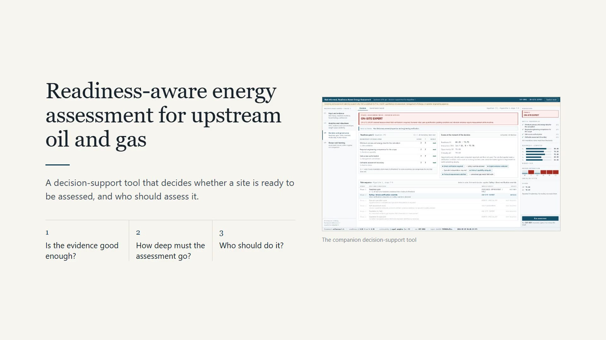
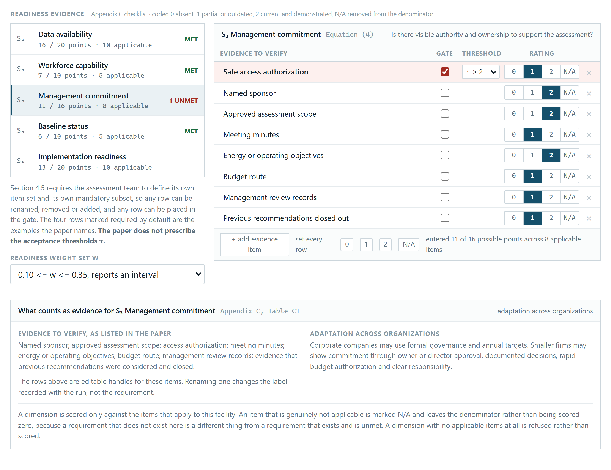
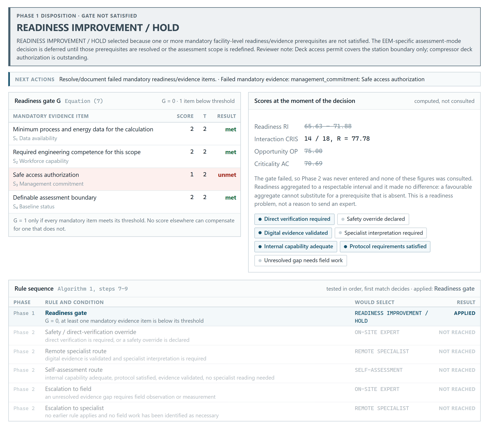
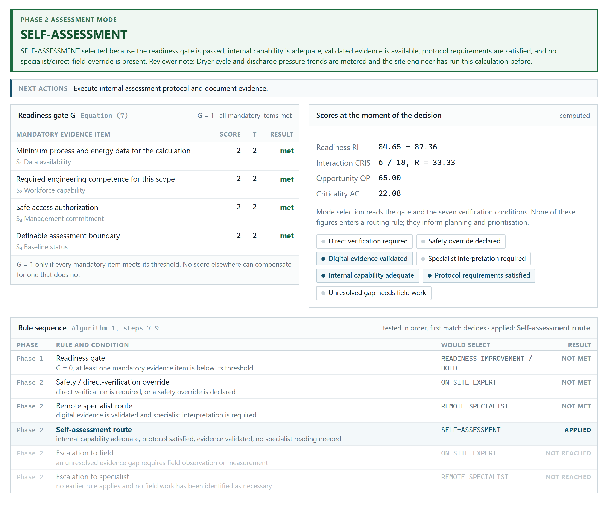
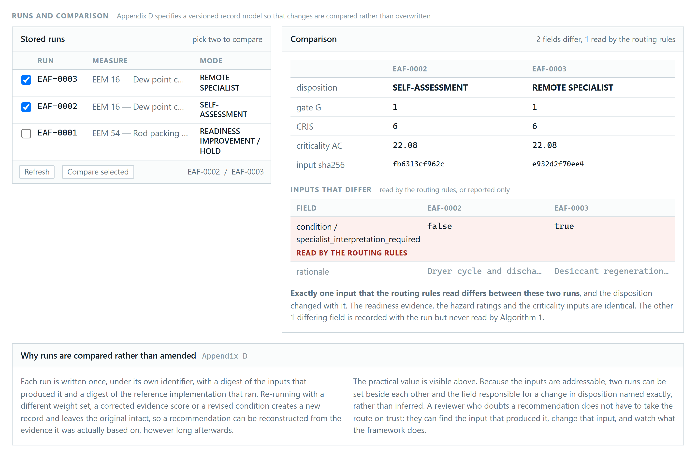
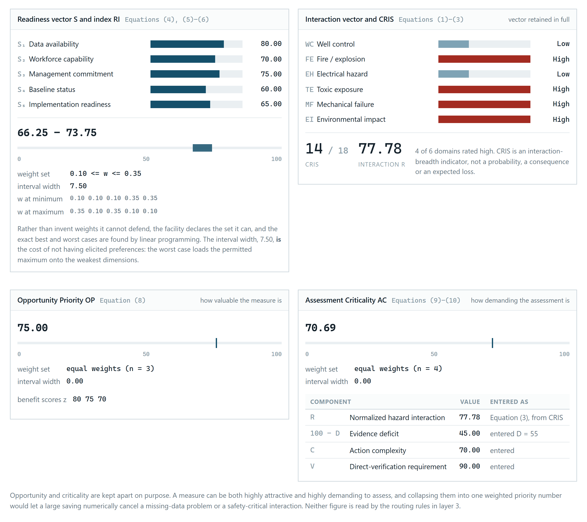
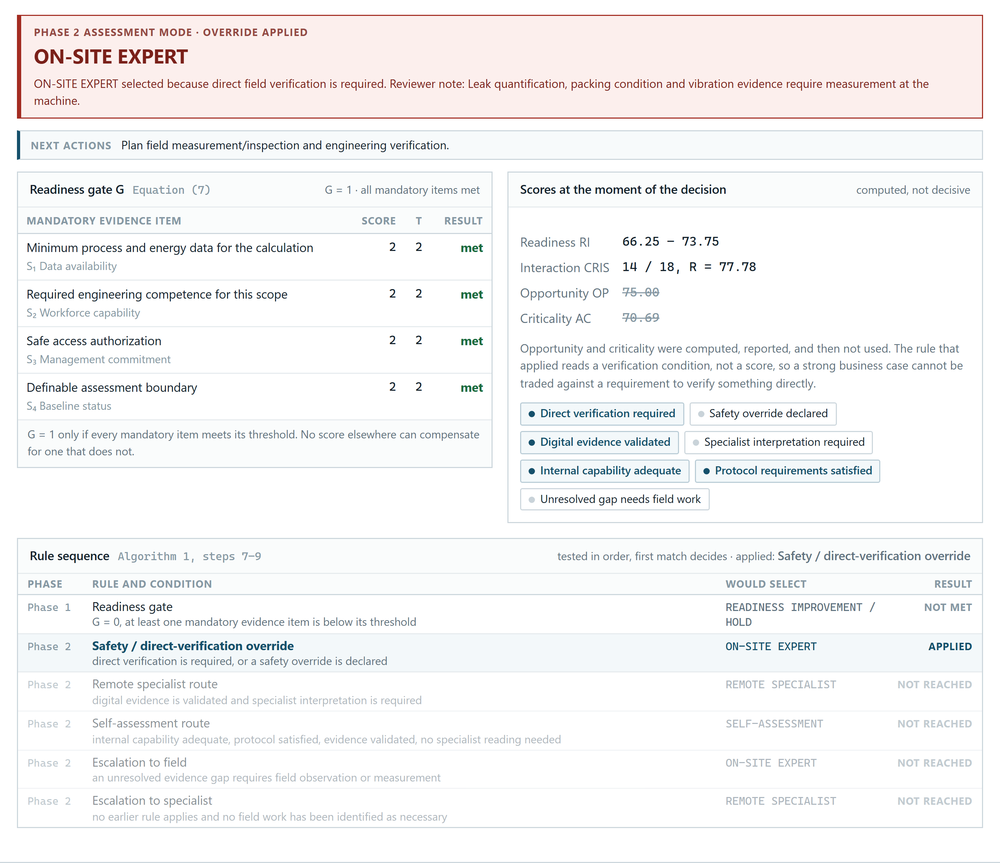

# Risk-Informed, Readiness-Aware Energy Assessment for Upstream Oil and Gas

A working decision-support prototype for the research paper *Risk-Informed, Readiness-Aware
Energy Assessment in Upstream Oil and Gas Operations: A Robust Decision Framework and
Explainable Digital Tool Architecture*.

The tool answers three questions before any energy-efficiency measure is assessed:

1. **Is the evidence good enough** to assess this measure at all?
2. **How deep** does the assessment need to go?
3. **Who should do it:** the site's own team, a remote specialist, or an expert on site?

Every result is computed live by the paper's Python reference implementation. Nothing is
stored in advance, and nothing is calculated in the browser.

---

## Demo video

[](demo/energy-assessment-demo.mp4)

**[Watch the demo (8 min, MP4)](demo/energy-assessment-demo.mp4)**. A one-minute summary of
the research, then the three case studies running live in the tool.

| Time | Section |
|---|---|
| 0:00 | Summary of the research |
| 0:55 | The tool |
| 1:28 | Case study 1: the readiness check |
| 3:16 | Case study 2: who should assess |
| 5:00 | Case study 3: the safety override |
| 7:06 | Audit trail, verification and adoption |

## The paper

[`paper/Risk_Informed_Energy_Assessment_Upstream_Oil_Gas_with_Appendix_E.docx`](paper/Risk_Informed_Energy_Assessment_Upstream_Oil_Gas_with_Appendix_E.docx)

Appendix E of the paper documents this tool and presents the three case studies below, with
the six figures in [`figures/`](figures).

---

## The research in brief

Energy-saving changes in upstream oil and gas, such as re-loading a generator, controlling a
compressor or recovering heat, can also affect safety-critical equipment. The framework
keeps four judgements separate so that none of them can hide another:

| | What it covers |
|---|---|
| **65 measures** | A traceable library of energy-efficiency measures across drilling, well-fluid extraction and surface treatment |
| **6 hazard interactions** | Each measure is profiled against well control, fire and explosion, electrical, toxic exposure, mechanical failure and environmental impact. The summary score (CRIS) is a screening indicator, not a risk estimate |
| **5 readiness dimensions** | A site's readiness is judged from its own evidence and reported as a range, rather than a single number built on assumed weights |
| **Opportunity vs criticality** | How attractive a measure is stays separate from how demanding it is to assess, so a strong business case can never make up for missing evidence |

Every decision then follows two steps:

```
Step 1  Readiness check        Is every mandatory prerequisite in place?
                               No  -> READINESS IMPROVEMENT / HOLD (the missing item is named)
                               Yes -> Step 2

Step 2  Choose the assessor    Rules tested in order, first match decides:
                               1. Safety or field-verification need     -> ON-SITE EXPERT
                               2. Validated data, needs a specialist    -> REMOTE SPECIALIST
                               3. Capable in-house team                 -> SELF-ASSESSMENT
                               4. Anything unresolved escalates
```

No score can override the readiness check or the safety rule.

---

## The prototype

The interface follows the four-layer architecture specified in the paper:

| Layer | Purpose | What it shows |
|---|---|---|
| **L1** Input and evidence | Collect the facts | Measure library, readiness checklist, hazard ratings, judgement inputs, verification conditions |
| **L2** Analytics and robustness | Compute the scores | Readiness vector and interval, hazard profile and CRIS, opportunity and criticality |
| **L3** Decision and governance | Make the call | Readiness check item by item, the ordered rule sequence, the outcome and its reasoning |
| **L4** Output and learning | Keep the record | Assessment record, action register, run comparison, reproduction of published results |

A status column on the right shows the readiness check, readiness scores, hazard profile and
outcome on every screen.

---

## Three case studies

All three are verification cases from the paper. Between them they cover all four possible
outcomes. Each one stores **input values only**, and loading it and pressing **Run
assessment** produces the result.

### 1. Can we even study this yet?

A gas gathering station looks ready: meters listed, fuel bills filed, a competent engineer on
site, and an approved scope. But the access permit covers the station boundary, not the
compressor deck. Readiness still reads 65.63 to 71.88, and the outcome is
**READINESS IMPROVEMENT / HOLD**. Opportunity and criticality are computed, then struck
through, because they were never consulted. Authorize deck access, run again, and the check
passes.

*In practice:* a hold is a named to-do list, not an expensive and inconclusive site visit.

| Input evidence | Outcome |
|---|---|
|  |  |

### 2. Who should do the study?

A drilling-support utility group wants to lower compressed-air dryer pressure (measure 16, a
low hazard-interaction measure). With validated data and an engineer who can interpret it,
the outcome is **SELF-ASSESSMENT**. Change exactly one condition, so that specialist
interpretation is required, and it becomes **REMOTE SPECIALIST**. The run comparison shows the
single input that changed the route.

*In practice:* specialist time goes only where it is needed, and is delivered remotely from
validated data.

| First run | Two runs compared |
|---|---|
|  |  |

### 3. Why can't a strong business case avoid the trip?

Rod-packing maintenance and leak reduction on a reciprocating compressor (measure 54) cuts
fuel, recovers product and reduces emissions. The site passes every readiness check. The tool
reproduces every published value for this measure, but leak rate, packing condition and
vibration can only be measured at the machine, so the override applies before any score is
reached and the outcome is **ON-SITE EXPERT**.

*In practice:* a high hazard profile shapes the verification plan. It does not cancel the
project.

| Analytics | Outcome |
|---|---|
|  |  |

---

## Quick start

Requires **Python 3.10 or newer**.

**Windows:** double-click `run.bat`. It installs the dependencies, starts the server and
opens the browser.

**Any platform:**

```bash
pip install -r requirements.txt
python -m uvicorn app:app --reload
```

Then open <http://127.0.0.1:8000>.

**VS Code:** open the folder and press **F5**.

To try a case study: **L1, Scope, choose a case, Load inputs, Run assessment**.

### Check it against the paper

```bash
python verify.py
```

No server needed. It recomputes every value the paper reports, runs all case studies through
the web layer, and tries to break the non-compensatory rules. Expected output:

```
43 of 43 checks passed.
```

---

## Results reproduced

| Published result | Paper | Tool |
|---|---|---|
| Readiness S = (80, 70, 75, 60, 65), equal weights | 70.0 | 70.00 |
| Same, weights bounded 0.10 to 0.35 | 66.25 to 73.75 | 66.25 to 73.75 |
| Measure 54: CRIS, R | 14, 77.78 | 14, 77.78 |
| Measure 54: opportunity priority | 75.0 | 75.00 |
| Measure 54: assessment criticality | 70.69 | 70.69 |
| Measure 54 with direct verification required | ON-SITE EXPERT | ON-SITE EXPERT |
| Low-interaction case: R, criticality | 33.33, 22.08 | 33.33, 22.08 |
| Validated evidence and specialist interpretation | REMOTE SPECIALIST | REMOTE SPECIALIST |
| Failed readiness check | HOLD | HOLD |
| CRIS values recomputed from the hazard coding that disagree | 0 of 65 | 0 of 65 |
| Mean CRIS: drilling, extraction, surface treatment | 8.84, 10.00, 11.19 | 8.84, 10.00, 11.19 |

---

## Repository layout

| File | Role |
|---|---|
| `assessment_framework.py` | The paper's reference implementation of the full method. Used unmodified. |
| `app.py` | FastAPI web layer. Turns form values into the framework's inputs and returns its record unchanged. Contains no formulas or decision rules. |
| `index.html` | The whole interface in one file, with no build step. |
| `checklist.py` | Readiness evidence items, hazard domains, verification conditions and rule descriptions. |
| `cases.py` | The three case studies, stored as inputs only. |
| `storage.py` | Append-only SQLite record store with run IDs and SHA-256 digests of inputs and framework code. |
| `reproduction.py` | Compares framework output with every value the paper states. Shared by the UI and `verify.py`. |
| `verify.py` | The 43-check verification script. |
| `capture_figures.py` | Regenerates the six figures in `figures/` with a headless browser. |
| `eem_library.json` | The 65 measures and their hazard coding, used to pre-fill ratings. |
| `demo/` | Demo video and thumbnail. |
| `paper/` | The manuscript, including Appendix E. |
| `figures/` | The six figures used in Appendix E. |

`assessment_records.db` is created on first run and holds the run history. Delete it to start
fresh.

---

## How it works

```
index.html  --POST-->  app.py  -->  assessment_framework.run_assessment_algorithm()
                                      readiness vector and readiness check
                                      readiness interval (linear programming)
                                      hazard profile and CRIS
                                      opportunity and criticality envelopes
                                      ordered mode rules
                         |
                     storage.py  -->  append-only record, run ID, input digest
                         |
index.html  <--JSON--  record returned unchanged
```

Every run records its inputs, an input digest, the framework version and a digest of the code
that produced it, so any decision can be reconstructed and compared rather than overwritten.

---

## Design choices and limitations

- **Thresholds are tool defaults.** Each mandatory item defaults to a threshold of 2. The paper
  requires thresholds but does not give values.
- **Case-study inputs are illustrative.** Readiness scores were chosen so the tool reproduces
  the paper's worked example. Facility names are marked illustrative.
- **Not field-validated.** The framework is pre-calibration. Independent expert review and
  multi-facility pilots are needed before any threshold is used as a rule.
- **"Not assessed" cannot be represented for hazards.** The reference implementation accepts
  only ratings 0 to 3.
- **Rank stability between two measures** is implemented in the framework but not yet exposed
  in the interface. Comparing two runs is supported.

---

## Scope

This is a screening and assessment-planning aid. It is **not** a risk assessment and does not
replace PHA, HAZOP, quantitative risk assessment, management of change or operator
engineering approval. Hazard ratings describe interaction potential, not probabilities or
consequences. The tool recommends and explains. It does not authorize process changes.
